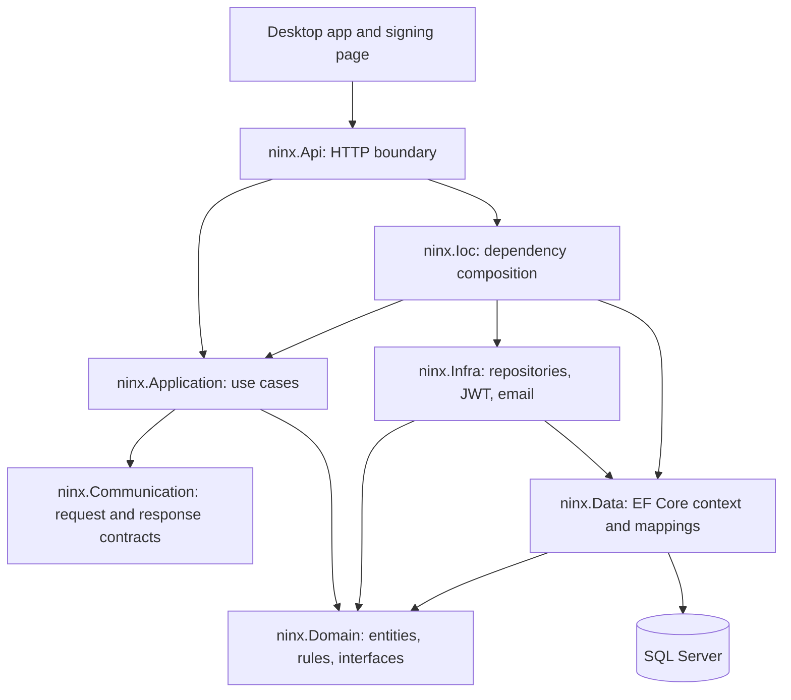

<div align="center">

# Ninx API

**Retail management and store credit, backed by a C#/.NET API.**

[](https://github.com/maat-aug/ninx-api/actions/workflows/ci.yml)


[Features](#features) · [Architecture](#architecture) · [Getting Started](#getting-started) · [API Documentation](#api-documentation)

</div>

Ninx helps small retailers manage sales, inventory, customers, and **store credit (fiado)**: purchases paid for later. This repository contains the business rules and HTTP API shared by the desktop application and the customer-facing signing page.

Its central workflow connects credit limits, account agreements, sales, repayments, and electronic signatures. A credit sale remains pending until its document is signed; confirmation then applies the corresponding inventory and payment changes.

## Features

| Capability | What the API handles |
| --- | --- |
| Sales and inventory | Immediate-payment and credit sales, product categories, stock movements, and sale cancellation. |
| Customer credit | Credit limits, due dates, outstanding balances, individual repayments, and repayments covering multiple sales. |
| Credit account agreements | Versioned opening agreements, authorized purchasers, individual purchaser limits, and authorization revocation. |
| Electronic signatures | PDF generation from templates, public signing links, signed document storage, SHA-256 hashes, and an evidence page with signing metadata. |
| Multiple stores | Store selection at login, switching the active store, and store-scoped business operations. |
| Access control | JWT authentication, BCrypt password hashing, store roles with explicit permissions, owner privileges, and global administration. |
| Reporting | Sales dashboards, receivables aging, margins, ABC product analysis, stock turnover, customer insights, and store comparisons. |
| Administration | Subscription plans and payment history, audit records, and password recovery through Brevo. |

<details>
<summary><strong>Business rules worth exploring</strong></summary>

- [Sale processing](src/ninx.Application/Services/Venda/VendaService.cs) checks available credit and active account agreements, and defers credit-sale stock deductions until signature confirmation.
- [Credit accounts](src/ninx.Application/Services/ContaFiado/ContaFiadoService.cs) connect signed agreement versions to account activation and authorized purchasers.
- [Signature confirmation](src/ninx.Application/Services/AssinaturaEletronica/AssinaturaEletronicaService.cs) records the submitted PDF, its hash, the signing time, IP address, and device information, then applies the associated business operation.
- Customer and store deactivation retain records through an `Ativo` flag instead of deleting their history.
- Password recovery and public signing endpoints have IP-based rate limits configured in [Program.cs](src/ninx.Api/Program.cs).

</details>

## Tech Stack

| Technology | Role |
| --- | --- |
| C# / .NET 10 / ASP.NET Core | Typed business services and controller-based HTTP endpoints. |
| Entity Framework Core 10 / SQL Server | Relational persistence, mappings, and schema migrations; the deployment workflow targets Azure SQL. |
| JWT Bearer / BCrypt.Net-Next | Signed access tokens and password hashing. |
| FluentValidation / Mapster | Request and entity validation, and entity-to-DTO mapping. |
| iText / pdfHTML | Rendering document templates as PDFs and appending signing evidence. |
| Brevo HTTP API | Transactional email for password recovery. |
| Swashbuckle / OpenAPI | Interactive API documentation with JWT authorization support. |
| xUnit / Moq / FluentAssertions / SQLite | Unit tests and HTTP integration tests using an in-memory relational database. |
| Docker / GitHub Actions / Azure Container Apps | Container packaging, automated checks, migrations, and deployment. |

## Architecture

The solution follows a layered structure inspired by Clean Architecture. Application services express use cases through repository interfaces; persistence and external integrations supply their implementations. This keeps business workflows separate from HTTP handling and database access.

The domain models retail concepts such as stores, sales, credit accounts, and permissions. Business orchestration primarily lives in application services, with focused domain rules for balances and due dates.



<details>
<summary><strong>Solution layout and design choices</strong></summary>

```text
src/
  ninx.Api/             Controllers, middleware, filters, Swagger, startup
  ninx.Application/     Business services, validators, documents, mappings
  ninx.Communication/   Request and response DTOs
  ninx.Domain/          Entities, enums, rules, exceptions, interfaces
  ninx.Data/            DbContext, entity configuration, migrations
  ninx.Infra/           Repositories, unit of work, JWT, email
  ninx.Ioc/             Dependency injection registrations
  ninx.Tests/           Unit, validation, mapping, and integration tests
```

- **Store context:** JWT claims identify the user, selected store, role, and permissions. Services and repositories enforce access within this context.
- **Transactions:** a unit of work coordinates persistence, with explicit transactions in workflows such as sale creation and credit repayments.
- **Authentication:** `POST /api/Login` issues a token; `POST /api/TrocarComercio/{comercioId}` issues a new token for another permitted store. There is no refresh-token flow.
- **Contracts:** Portuguese identifiers in DTOs and routes are the actual API contract, including `comercioId`, `cargoPermissoes`, and `documentoBase64`.

</details>

## Getting Started

### Prerequisites

- .NET 10 SDK.
- SQL Server access, or Docker with the repository's SQL Server 2022 development service.
- The `dotnet-ef` CLI matching EF Core 10.

### 1. Clone and restore

```bash
git clone https://github.com/maat-aug/ninx-api.git
cd ninx-api
dotnet restore ninx-api.slnx
dotnet tool install --global dotnet-ef --version 10.0.5
```

If `dotnet-ef` is already installed, check its version with `dotnet ef --version` and update it if needed.

### 2. Configure local settings

Create `src/ninx.Api/appsettings.Local.json`, which is loaded by the application and ignored by Git:

```json
{
  "ConnectionStrings": {
    "DefaultConnection": "Server=localhost,1433;Initial Catalog=ninx-db;User ID=sa;Password=YOUR_LOCAL_SQL_PASSWORD;Encrypt=True;TrustServerCertificate=True;"
  },
  "Jwt": {
    "Secret": "REPLACE_WITH_A_RANDOM_SECRET_OF_AT_LEAST_32_BYTES",
    "Issuer": "NinxSGC",
    "Audience": "NinxSGCClient",
    "ExpiresInMinutes": 1200
  }
}
```

Replace the password and JWT placeholder with your own local values. The application validates that the JWT secret contains at least 32 UTF-8 bytes.

For the optional development database, copy `.env.example` to `.env`, set `LOCAL_DB_PASSWORD` to the same SQL password, and run from the repository root:

```bash
docker compose -f docker/docker-compose.yml --env-file .env --profile dev up -d db
```

Wait for SQL Server to accept connections before applying migrations. If using an existing SQL Server, adapt the connection string and skip this container step.

<details>
<summary><strong>Email and configuration sources</strong></summary>

Password recovery requires valid `Brevo:ApiKey`, `Brevo:SenderEmail`, and `Brevo:SenderName` settings. Add them to the local JSON file when testing email delivery.

`Program.cs` also reads a `.env` file from the process working directory and maps keys such as `DB_CONNECTION_STRING` and `JWT_SECRET` into configuration. Non-empty mapped values override earlier settings. The parser does not expand `${VARIABLE}` expressions, so use complete literal values.

For local .NET commands, the project-local JSON file avoids depending on where a launcher sets the working directory. Docker Compose uses the root `.env` separately to populate container environment variables.

</details>

### 3. Apply migrations and start the API

```bash
dotnet ef database update --project src/ninx.Data --startup-project src/ninx.Api
dotnet dev-certs https --trust
dotnet run --project src/ninx.Api --launch-profile https
```

Open [Swagger UI](https://localhost:7093/swagger). Migrations are applied explicitly; the application does not run them automatically on startup.

**First login:** the repository does not provide a bootstrap account or a general-purpose user seed command. Login requires an active user with a BCrypt password hash and an active store membership; subscription status is also checked. A newly migrated database therefore needs account provisioning before authenticated workflows can be exercised. Integration tests create their own fixtures independently.

<details>
<summary><strong>Run the API in Docker</strong></summary>

Fill in `DB_CONNECTION_STRING` and `JWT_SECRET` in the root `.env` file. For the Compose database, the API container must use `Server=db,1433`; migration commands running on the host use `Server=localhost,1433`.

After applying migrations from the host, start the API:

```bash
docker compose -f docker/docker-compose.yml --env-file .env up --build api
```

The container exposes [Swagger at localhost:8080](http://localhost:8080/swagger). The `db` service is optional and must be started separately with the `dev` profile when needed.

</details>

## API Documentation

- **Swagger UI:** [https://localhost:7093/swagger](https://localhost:7093/swagger)
- **OpenAPI JSON:** [https://localhost:7093/swagger/v1/swagger.json](https://localhost:7093/swagger/v1/swagger.json)
- **HTTP launch profile:** `dotnet run --project src/ninx.Api --launch-profile http` uses port `5258`.

Swagger is configured in all environments. Authenticate through `POST /api/Login`, then use **Authorize** to supply the returned JWT for protected endpoints. Public signing endpoints accept a document GUID instead of a user session.

## Tests and Delivery

```bash
dotnet build ninx-api.slnx
dotnet test src/ninx.Tests
```

The suite covers application services, validators, domain calculations, mappings, and integration scenarios for login, sales, signatures, tenant isolation, and customer routes. Integration tests build an ASP.NET Core test host with SQLite in memory, so they do not require the development SQL Server.

[CI](.github/workflows/ci.yml) restores, builds, and tests pushes and pull requests. The separate [Azure deployment workflow](.github/workflows/deploy.yml) runs tests before publishing a Docker image, applying SQL migrations, and updating Azure Container Apps on pushes to `main`.

## Ninx Ecosystem

| Repository | Responsibility |
| --- | --- |
| **ninx-api** | Business rules, authentication, persistence, and documents. |
| [ninx-front](https://github.com/maat-aug/ninx-front) | React and Tauri desktop application for store operators. |
| [ninx-signature](https://github.com/maat-aug/ninx-signature) | Browser-based document signing for customers. |

## Academic Context

Ninx is my Information Systems capstone project (**Trabalho de Conclusão de Curso — TCC**). It applies my focus on C# and .NET to a practical retail problem, bringing together business modeling, relational data, access control, automated tests, and deployment in a complete application workflow.

## License

No license file is currently included in this repository.

## Author

**Matheus Augusto Teixeira Silva** — Information Systems student focused on C# and .NET.

[GitHub](https://github.com/maat-aug) · [LinkedIn](https://www.linkedin.com/in/matheus-augusto-a89348265/)
